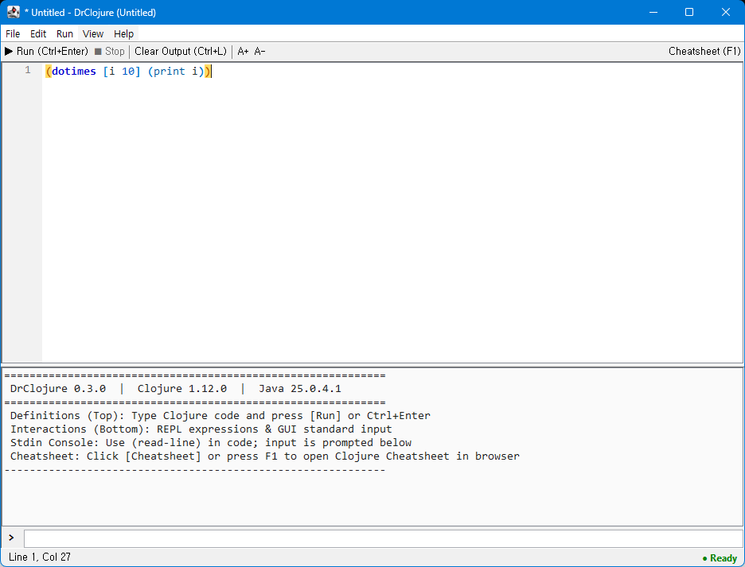

# DrClojure

DrClojure is a newbie-friendly Clojure IDE inspired by DrRacket, written in Clojure.

## Features

- **DrRacket-Style Dual Pane Layout**:
  - **Definitions Pane (Top)**: Code editor for writing Clojure definitions and programs.
  - **Interactions Pane (Bottom)**: Interactive REPL console showing output, return values, and real-time execution.
- **Real-Time Output Streaming**: `println`, `prn`, and standard output/error stream live into the GUI console.
- **GUI Standard Input (`stdin`)**: Interactive console input (`read-line`) is processed directly within the GUI prompt with automatic focus and status indication.
- **Asynchronous Execution & Stop Button**: Long-running loops or calculations run off the UI thread and can be safely interrupted at any time via the **Stop** button or `Escape`.
- **REPL Command History**: Navigate previous REPL commands in the prompt using `Up` and `Down` arrow keys.
- **7-Level Rainbow Parentheses**: Cycles through 7 distinct, vibrant colors (Warm Amber, Royal Blue, Violet, Forest Green, Crimson, Teal, Rose) based on nesting depth `(mod depth 7)` across parentheses `()`, brackets `[]`, and braces `{}`, making nested Clojure code instantly readable. Mismatched or unclosed brackets are highlighted in bold red.
- **Lexical-Aware Bracket Matching**: Highlights matching bracket pairs in warm amber when the caret is adjacent to any bracket. Fully token-aware: brackets inside comments, strings, regexes, and character literals are completely ignored.
- **Smart Block Indentation & Unindent**: `Tab` inserts 2 spaces and indents selected blocks; `Shift+Tab` unindents single lines or selected blocks by 2 spaces.
- **Rename (Refactor) Symbol**: Press `Shift+F6` or `F2` to safely rename all occurrences of a symbol across the file (with lexical filtering preventing unintended replacements in comments or strings).
- **Jump to Definition**: Press `F12` or `Ctrl+B` to instantly jump to top-level definitions (`defn`, `def`, `defmacro`, etc.) or local bindings, scroll into view, or inspect external Clojure Var definitions.
- **Editor Context Menu**: Right-click anywhere in the editor for quick access to Jump to Definition, Rename Symbol, Indent, Unindent, Cut, Copy, and Paste.
- **Clojure Syntax Highlighting**: Real-time syntax coloring for special forms, built-ins, constants, keywords, strings, characters, numbers, and comments.
- **Undo / Redo with Dirty Tracking**: Standard `Ctrl+Z` / `Ctrl+Y` support with clean undo isolation and accurate `*` unsaved changes tracking that automatically restores clean state on undo.
- **Flexible Editor Width**: Code editor dynamically fills the window width while enabling horizontal scrollbars only when lines exceed the pane width.
- **Clojure Cheatsheet**: Press `F1` or click Cheatsheet to open [Clojure - Cheatsheet](https://clojure.org/api/cheatsheet) in your web browser, with offline reference examples also available.
- **Zero External Heavy Dependencies**: Runs directly with standard Clojure and Java Swing.

## Screenshot



## Interface

```
+-------------------------------------------------------------+
| * myfile.clj - DrClojure (C:\projects\myfile.clj)    _ [] X |
+-------------------------------------------------------------+
| File   Edit   Run   View   Help                             |
+-------------------------------------------------------------+
|[▶ Run] [⏹ Stop] | [Clear] | [A+] [A-]          [Cheatsheet]|
+-------------------------------------------------------------+
| Definitions:                                                |
|   1 | (defn greet []                                        |
|   2 |   (println "What is your name?")                      |
|   3 |   (let [name (read-line)]                             |
|   4 |     (println (str "Hello, " name "!"))))              |
|   5 | (greet)                                               |
+=============================================================+
| Interactions / Output:                                      |
|   ; --- Running Definitions ---                             |
|   What is your name?                                        |
|   World                                                     |
|   Hello, World!                                             |
|   => nil                                                    |
+-------------------------------------------------------------+
| [stdin] > [                                                ]|
+-------------------------------------------------------------+
| Line 5, Col 9                                       ● Ready |
+-------------------------------------------------------------+
```

## Quick Start (with `clj`)

No Leiningen is required! You can run DrClojure directly using the standard Clojure CLI:

### Run DrClojure
```bash
clj -M -m DrClojure.core
```

Or open a file directly:
```bash
clj -M -m DrClojure.core myfile.clj
```

### On Windows
Double-click `DrClojure.bat` or run:
```cmd
DrClojure.bat [optional-file.clj]
```

### On Linux / macOS
Make executable and run `DrClojure.sh`:
```bash
chmod +x DrClojure.sh
./DrClojure.sh [optional-file.clj]
```

### Run Automated Tests
```bash
clj -M:test
```

*(Note: Leiningen is also supported via `lein run`, `lein test`, and `lein uberjar` if desired).*

## Keyboard Shortcuts

| Shortcut | Action |
| :--- | :--- |
| `Ctrl + Enter` / `F5` | Run Definitions (execute code in editor) |
| `Ctrl + E` | Run Selected text or current line |
| `Escape` | Stop actively running evaluation |
| `Ctrl + L` | Clear Output / reset console |
| `Ctrl + S` | Save file |
| `Ctrl + Shift + S` | Save As... |
| `Ctrl + O` | Open file |
| `Ctrl + N` | New file |
| `Ctrl + Z` | Undo |
| `Ctrl + Y` / `Ctrl + Shift + Z` | Redo |
| `Tab` | Insert 2 spaces / indent selection |
| `Shift + Tab` | Unindent line or selected block |
| `F12` / `Ctrl + B` | Jump to Definition |
| `Shift + F6` / `F2` | Rename Symbol (Refactor) |
| `Ctrl + =` / `Ctrl + -` | Zoom In / Zoom Out font |
| `Ctrl + 0` | Reset font size |
| `F1` | Open Clojure Cheatsheet in web browser |
| `Up` / `Down` (in prompt) | Navigate REPL command history |

## License

Copyright 2012-2026 Kim, Taegyoon

Distributed under the Eclipse Public License, the same as Clojure.
